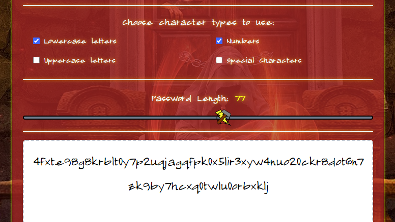
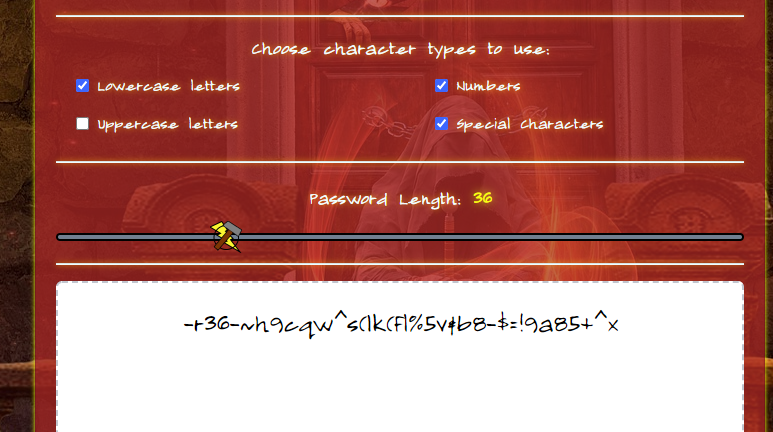
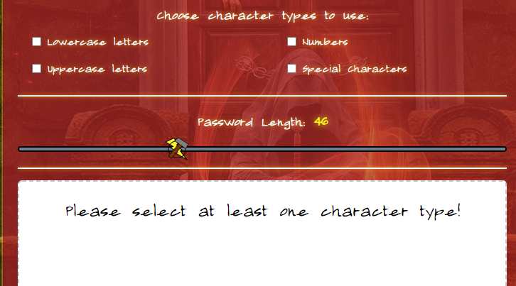
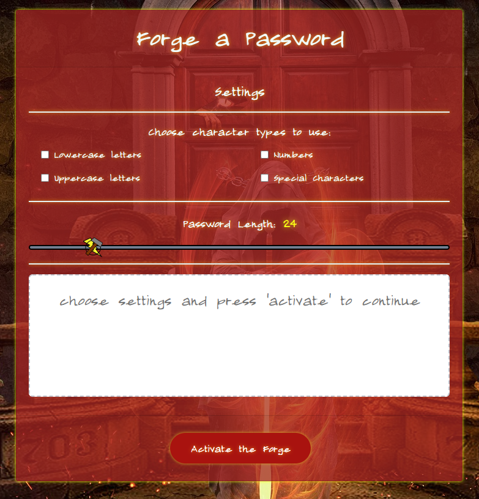

# Cryptoforge
## An awesome name for a modest widget

Cryptoforge is a simple password generator.  It has nothing to do with cryptocurrency.  I just liked the name.

Cryptoforge has the following stand-out features:
* A really sweet aesthetic
* Passwords are generated based on user-selected character pool
* The app yells at you if you try to generate a password without selecting any characters
* The slider bar is 100% more metal than any of our competitors

## Cryptoforge in action

### Password generation only uses selected character pools

Password length is determined by the slider.

### Users get an error message if they don't use any of the character pools

### Come on, you know it looks cool

## Check out the website!

> https://nvanbaak.github.io/cryptoforge/